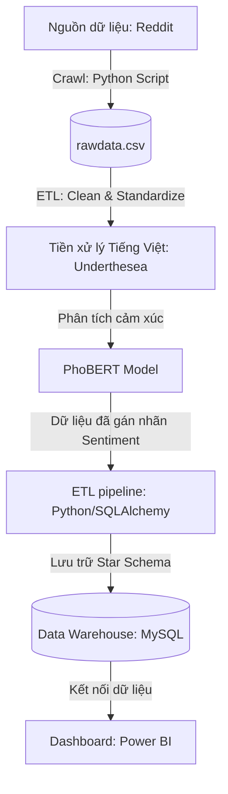

# Phân Tích Cảm Xúc Ý Kiến Khách Hàng Về Xe Điện Từ Reddit (PhoBERT & Streamlit Dashboard)

Dự án này là hệ thống thu thập dữ liệu từ Reddit về chủ đề xe điện, thực hiện tiền xử lý văn bản tiếng Việt, phân tích cảm xúc (Sentiment Analysis) sử dụng mô hình học sâu **PhoBERT**, lưu trữ vào kho dữ liệu quan hệ (Data Warehouse) thiết kế theo mô hình hình sao (Star Schema), và trực quan hóa qua Dashboard tương tác **Streamlit**.

---

## 1. Kiến Trúc Hệ Thống & Pipeline Chi Tiết

Hệ thống hoạt động theo pipeline 5 bước khép kín:



### Chi tiết các bước trong Pipeline:
1. **Thu thập dữ liệu (Crawling):** Lấy dữ liệu bài đăng và bình luận liên quan đến xe điện trên Reddit, lưu dữ liệu thô vào file `rawdata.csv`.
2. **Tiền xử lý văn bản (Preprocessing):**
   - Loại bỏ các ký tự đặc biệt, link, HTML tags.
   - Chuẩn hóa Telex, viết tắt (vd: *ko, k* -> *không*, *vfs* -> *vinfast*).
   - Tách từ tiếng Việt bằng thư viện `underthesea` (Ví dụ: "xe này chạy ngon" -> "xe này chạy ngon").
3. **Phân tích cảm xúc (Sentiment Analysis):** Sử dụng mô hình PhoBERT base fine-tuned cho tiếng Việt để phân loại bình luận thành: **Tích cực (Positive)**, **Tiêu cực (Negative)**, hoặc **Trung lập (Neutral)**.
4. **Lưu trữ Data Warehouse (ETL & DWH):** Chuyển đổi dữ liệu và nạp (Load) vào database PostgreSQL/MySQL thiết kế theo mô hình Star Schema để tối ưu cho việc truy vấn báo cáo.
5. **Trực quan hóa (BI Dashboard):** Streamlit Dashboard kết nối trực tiếp database hiển thị biểu đồ phân bố cảm xúc, từ khóa nổi bật (Word Cloud), xu hướng tương tác, và giao diện thử nghiệm mô hình trực tiếp (Real-time Prediction Demo).

---

## 2. Cấu Trúc Thư Mục Dự Án

Dự án được tổ chức như sau:

* [README.md](file:///C:/Users/phong/.gemini/antigravity-ide/scratch/vietnamese-sentiment-analysis/README.md) - Tài liệu hướng dẫn chi tiết dự án (chủ đề và pipeline).
* [requirements.txt](file:///C:/Users/phong/.gemini/antigravity-ide/scratch/vietnamese-sentiment-analysis/requirements.txt) - Danh sách các thư viện cần cài đặt.
* [crawler.py](file:///C:/Users/phong/.gemini/antigravity-ide/scratch/vietnamese-sentiment-analysis/crawler.py) - Script crawl dữ liệu Reddit về xe điện và xuất ra `rawdata.csv`.
* [preprocess.py](file:///C:/Users/phong/.gemini/antigravity-ide/scratch/vietnamese-sentiment-analysis/preprocess.py) - Script làm sạch và tách từ (Tokenization) tiếng Việt.
* [sentiment_model.py](file:///C:/Users/phong/.gemini/antigravity-ide/scratch/vietnamese-sentiment-analysis/sentiment_model.py) - Trích xuất đặc trưng và gán nhãn cảm xúc bằng mô hình PhoBERT.
* [db_setup.sql](file:///C:/Users/phong/.gemini/antigravity-ide/scratch/vietnamese-sentiment-analysis/db_setup.sql) - Schema thiết kế Data Warehouse dưới dạng SQL (Star Schema).
* [app.py](file:///C:/Users/phong/.gemini/antigravity-ide/scratch/vietnamese-sentiment-analysis/app.py) - Ứng dụng Dashboard tương tác viết bằng Streamlit.

---

## 3. Hướng Dẫn Cài Đặt & Chạy Dự Án

### Bước 1: Thiết lập môi trường ảo và cài đặt thư viện
Mở terminal trong thư mục dự án và chạy:
```bash
python -m venv venv
venv\Scripts\activate
pip install -r requirements.txt
```

### Bước 2: Tạo Cơ sở dữ liệu
Chạy các câu lệnh trong file [db_setup.sql](file:///C:/Users/phong/.gemini/antigravity-ide/scratch/vietnamese-sentiment-analysis/db_setup.sql) trên PostgreSQL hoặc MySQL client của bạn để tạo cấu trúc kho dữ liệu.

### Bước 3: Cấu hình và Thu thập dữ liệu
* Lấy **YouTube API Key** từ Google Cloud Console.
* Mở [crawler.py](file:///C:/Users/phong/.gemini/antigravity-ide/scratch/vietnamese-sentiment-analysis/crawler.py) nếu muốn chỉnh danh sách subreddit hoặc từ khóa tìm kiếm.
* Chạy script crawl để tạo dữ liệu thô:
  ```bash
  python crawler.py
  ```
* File đầu ra mặc định là `rawdata.csv` ở thư mục gốc; script cũng tạo bản sao tương thích tại `data/raw_comments.csv` để các bước sau không bị gãy.

### Bước 4: Tiền xử lý & Phân tích cảm xúc (PhoBERT)
Chạy script xử lý dữ liệu và đẩy vào database:
```bash
python sentiment_model.py
```

### Bước 5: Chạy Dashboard trực quan
Chạy Streamlit server để xem Dashboard:
```bash
streamlit run app.py
```
Giao diện dashboard sẽ được hiển thị tại địa chỉ mặc định `http://localhost:8501`.
