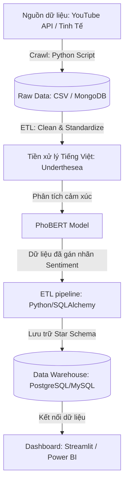

# Phân Tích Cảm Xúc Ý Kiến Khách Hàng Về Xe Điện Tại Việt Nam (PhoBERT & Streamlit Dashboard)

Dự án này là hệ thống thu thập dữ liệu (crawling) bình luận mạng xã hội (ví dụ từ YouTube/Diễn đàn), thực hiện tiền xử lý văn bản tiếng Việt, phân tích cảm xúc (Sentiment Analysis) sử dụng mô hình học sâu **PhoBERT**, lưu trữ vào kho dữ liệu quan hệ (Data Warehouse) thiết kế theo mô hình hình sao (Star Schema), và trực quan hóa qua Dashboard tương tác **Streamlit**.

---

## 1. Kiến Trúc Hệ Thống & Pipeline Chi Tiết

Hệ thống hoạt động theo pipeline 5 bước khép kín:



### Chi tiết các bước trong Pipeline:
1. **Thu thập dữ liệu (Crawling):** Lấy dữ liệu bình luận từ video YouTube review xe điện (VinFast VF3, VF8, VF9, BYD, v.v.) qua YouTube Data API v3.
2. **Tiền xử lý văn bản (Preprocessing):**
   - Loại bỏ các ký tự đặc biệt, link, HTML tags.
   - Chuẩn hóa Telex, viết tắt (vd: *ko, k* -> *không*, *vfs* -> *vinfast*).
   - Tách từ tiếng Việt bằng thư viện `underthesea` (Ví dụ: "xe này chạy ngon" -> "xe này chạy ngon").
3. **Phân tích cảm xúc (Sentiment Analysis):** Sử dụng mô hình PhoBERT base fine-tuned cho tiếng Việt để phân loại bình luận thành: **Tích cực (Positive)**, **Tiêu cực (Negative)**, hoặc **Trung lập (Neutral)**.
4. **Lưu trữ Data Warehouse (ETL & DWH):** Chuyển đổi dữ liệu và nạp (Load) vào database PostgreSQL/MySQL thiết kế theo mô hình Star Schema để tối ưu cho việc truy vấn báo cáo.
5. **Trực quan hóa (BI Dashboard):** Streamlit Dashboard kết nối trực tiếp database hiển thị biểu đồ phân bố cảm xúc, từ khóa nổi bật (Word Cloud), xu hướng tương tác, và giao diện thử nghiệm mô hình trực tiếp (Real-time Prediction Demo).

---

## 2. Cấu Trúc Thư Mục Dự Án

Dự án được cấu trúc theo các Phase phát triển và lưu trữ mã nguồn trong thư mục `Source`:

* **[README.md](file:///e:/vietnamese-sentiment-analysis/README.md)** - Tài liệu hướng dẫn chi tiết dự án.
* **[Source/](file:///e:/vietnamese-sentiment-analysis/Source)** - Thư mục chứa toàn bộ mã nguồn của dự án.
  * **[Source/requirements.txt](file:///e:/vietnamese-sentiment-analysis/Source/requirements.txt)** - Danh sách các thư viện cần cài đặt.
  * **[Source/phase_1_crawl/crawler.py](file:///e:/vietnamese-sentiment-analysis/Source/phase_1_crawl/crawler.py)** - Script thu thập bình luận từ YouTube API.
  * **[Source/phase_2_preprocess/preprocess.py](file:///e:/vietnamese-sentiment-analysis/Source/phase_2_preprocess/preprocess.py)** - Script làm sạch và tách từ (Word Segmentation) tiếng Việt.
  * **[Source/phase_3_modeling/sentiment_model.py](file:///e:/vietnamese-sentiment-analysis/Source/phase_3_modeling/sentiment_model.py)** - Phân tích cảm xúc, gán nhãn PhoBERT/Lexicon và chạy ETL nạp cơ sở dữ liệu.
  * **[Source/phase_4_dwh/db_setup.sql](file:///e:/vietnamese-sentiment-analysis/Source/phase_4_dwh/db_setup.sql)** - Thiết kế Data Warehouse dạng mô hình hình sao (Star Schema).
  * **[Source/phase_5_dashboard/app.py](file:///e:/vietnamese-sentiment-analysis/Source/phase_5_dashboard/app.py)** - Giao diện Streamlit Dashboard và chức năng thử nghiệm real-time.
* **[data/](file:///e:/vietnamese-sentiment-analysis/data)** - Lưu trữ dữ liệu thô, dữ liệu đã xử lý CSV và file DB SQLite (`sentiment_dwh.db`).

---

## 3. Hướng Dẫn Cài Đặt & Chạy Dự Án

### Bước 1: Thiết lập môi trường ảo và cài đặt thư viện
Mở terminal tại thư mục gốc của dự án (`vietnamese-sentiment-analysis`) và chạy các lệnh sau:
```powershell
# 1. Tạo môi trường ảo (nếu chưa có)
python -m venv venv

# 2. Kích hoạt môi trường ảo trên Windows
.\venv\Scripts\activate

# 3. Nâng cấp pip và cài đặt các thư viện yêu cầu từ thư mục Source
pip install --upgrade pip
pip install -r Source/requirements.txt
```

### Bước 2: Tạo Cơ sở dữ liệu Data Warehouse
Dự án tự động hỗ trợ 2 loại CSDL:
* **SQLite (Offline):** Được cấu hình tự động khi chạy quy trình mô hình. Hệ thống sẽ tự động khởi tạo cơ sở dữ liệu tại `data/sentiment_dwh.db` mà không cần cài đặt thêm.
* **MySQL (Online - Tùy chọn):** Bạn có thể cài đặt MySQL Server, sau đó import file [db_setup.sql](file:///e:/vietnamese-sentiment-analysis/Source/phase_4_dwh/db_setup.sql) để tạo cấu trúc Star Schema trước khi cấu hình kết nối trong Dashboard.

### Bước 3: Thu thập dữ liệu (Crawling)
* Đảm bảo bạn đã có **YouTube API Key** từ Google Cloud Console.
* Mở file [crawler.py](file:///e:/vietnamese-sentiment-analysis/Source/phase_1_crawl/crawler.py), điền API Key vào biến cấu hình tương ứng.
* Chạy lệnh thu thập dữ liệu:
  ```powershell
  python Source/phase_1_crawl/crawler.py
  ```
  *Dữ liệu bình luận thô sẽ được sinh ra dưới dạng file CSV trong thư mục `data/`.*

### Bước 4: Tiền xử lý, phân tích cảm xúc & nạp DWH (ETL)
Chạy script phân tích cảm xúc để tự động chạy qua mô hình PhoBERT (hoặc Lexicon nếu ngoại tuyến), gán nhãn phân loại cảm xúc, và thực hiện quy trình ETL nạp dữ liệu vào Data Warehouse:
```powershell
python Source/phase_3_modeling/sentiment_model.py
```
*Hệ thống sẽ lưu file kết quả processed CSV và tự động ghi dữ liệu vào các bảng Dim & Fact của SQLite / MySQL.*

### Bước 5: Chạy Streamlit Dashboard
Khởi chạy ứng dụng Dashboard tương tác trực tiếp:
```powershell
streamlit run Source/phase_5_dashboard/app.py
```
Sau khi khởi chạy thành công, trình duyệt sẽ tự động mở giao diện Dashboard tại địa chỉ: **`http://localhost:8501`**.

Tại đây, bạn có thể lọc dữ liệu theo dòng xe, khía cạnh phản hồi (trạm sạc, phần mềm, pin), xem thống kê lượng tiếp cận (Reach), tải dữ liệu Star Schema phục vụ Power BI, và thử nghiệm tính năng nhận diện cảm xúc trực tiếp.
