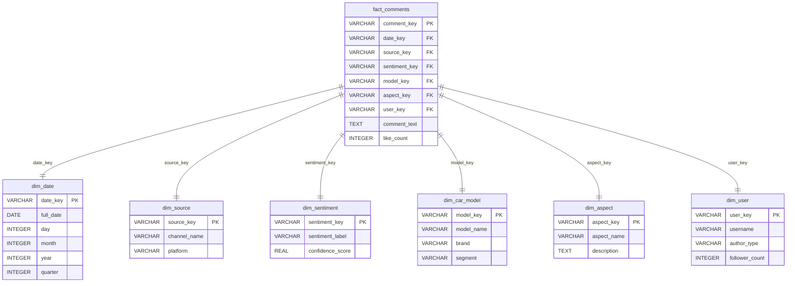
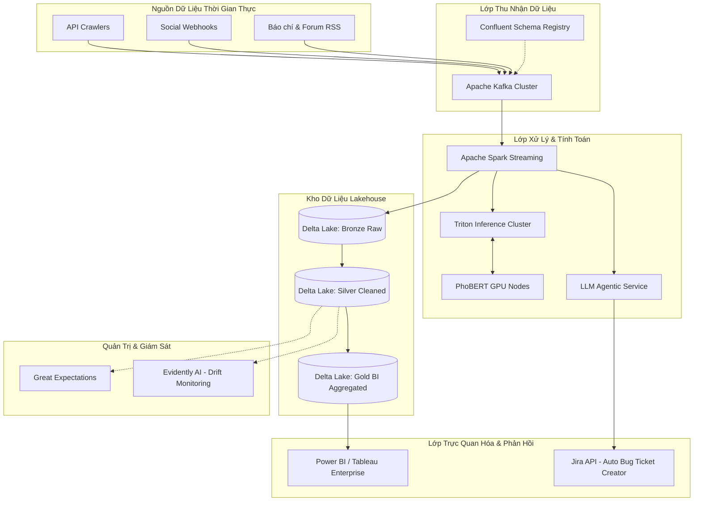

# BÁO CÁO DỰ ÁN: HỆ THỐNG SOCIAL LISTENING & PHÂN TÍCH CẢM XÚC THƯƠNG HIỆU VINFAST

Dự án xây dựng một giải pháp phân tích dữ liệu toàn diện (End-to-End Data Pipeline) nhằm thu thập, tiền xử lý, phân tích cảm xúc phản hồi của người dùng về các dòng xe điện VinFast trên môi trường mạng xã hội, lưu trữ vào Kho dữ liệu (Data Warehouse) theo mô hình hình sao (Star Schema), và trực quan hóa các chỉ số kinh doanh (BI) thông qua Dashboard.

---

## 1. Giới thiệu bài toán

### 1.1. Bối cảnh
VinFast đang tiên phong chuyển đổi hoàn toàn sang xe điện (EV) tại thị trường Việt Nam và quốc tế, liên tục ra mắt các dòng xe từ cỡ nhỏ đến cao cấp (VF 3, VF 5, VF e34, VF 6, VF 7, VF 8, VF 9). Mạng xã hội (YouTube, Facebook, các diễn đàn như Tinh Tế, Reddit, Twitter) trở thành nơi người tiêu dùng thảo luận, chia sẻ trải nghiệm thực tế và phản ánh các lỗi phát sinh. 

Lắng nghe mạng xã hội (**Social Listening**) là bài toán sống còn giúp VinFast:
- Nắm bắt kịp thời tâm lý, phản hồi của khách hàng về sản phẩm.
- Phát hiện sớm các sự cố kỹ thuật (lỗi phần mềm, lỗi ảo, vấn đề pin) để cải tiến sản phẩm.
- Định vị lợi thế cạnh tranh của hệ thống trạm sạc so với các thương hiệu ngoại nhập (BYD, Wuling, Xiaomi).

### 1.2. Thách thức kỹ thuật
1. **Dữ liệu phi cấu trúc và nhiễu**: Ý kiến người dùng mang tính tự do, chứa nhiều từ viết tắt (`ko`, `dc`), tiếng lóng (`tim`, `ae`), lỗi chính tả, và các bình luận rác (seeding, quảng cáo).
2. **Đặc trưng ngôn ngữ tiếng Việt**: Phức tạp trong tách từ ghép, xử lý phủ định (ví dụ: "không lỗi" là tích cực, "không tốt" là tiêu cực), và các câu tăng cường cảm xúc ("rất êm", "cực kỳ lỗi").
3. **Phân loại sai câu hỏi nghi vấn**: Các câu hỏi khảo sát thông tin trung lập của người dùng (ví dụ: *"Có ồn lắm không mọi người?"*) thường chứa các từ nhạy cảm dễ bị các mô hình AI hoặc Lexicon đánh nhãn nhầm là Tiêu cực.
4. **Yêu cầu phân tích kinh doanh (BI)**: Dữ liệu cần được chuẩn hóa và cấu trúc lại để các công cụ BI như Power BI, Tableau dễ dàng kết nối và xây dựng các báo cáo quản trị.

---

## 2. Mô tả dataset

Hệ thống sử dụng bộ dữ liệu kết hợp giữa dữ liệu thu thập thực tế từ API và dữ liệu mô phỏng đồng bộ thời gian nhằm mang lại cái nhìn toàn cảnh chân thực nhất.

### 2.1. Nguồn dữ liệu & Quy mô
- **Dữ liệu YouTube (Dữ liệu gốc thực tế)**:
  - Thu thập thông qua **YouTube API v3** từ 482 video đánh giá, lái thử xe điện tại Việt Nam.
  - Quy mô: **19,402 bình luận thực tế** đã qua bộ lọc làm sạch.
  - Thời gian đăng tải: Trải dài từ năm **2023 đến tháng 6/2026**.
- **Dữ liệu mô phỏng (Facebook, Twitter/X, Reddit, Tinh Tế)**:
  - Quy mô: **1,000 bình luận mô phỏng** được thiết kế dựa trên ngữ cảnh thực tế của từng nền tảng nhằm đại diện cho các kênh thảo luận ngoài YouTube.
  - Tổng quy mô dataset sau khi trộn và sắp xếp theo thời gian: **20,402 dòng dữ liệu**.

### 2.2. Cấu trúc các trường thông tin thô
| Tên cột | Kiểu dữ liệu | Mô tả |
| :--- | :--- | :--- |
| `comment_id` | VARCHAR(100) | Khóa chính xác định duy nhất bình luận |
| `author` | VARCHAR(100) | Tên người dùng/Tác giả bình luận |
| `author_type` | VARCHAR(20) | Phân nhóm tác giả: `Celeb` (KOLs) hoặc `Regular` (Người dùng thường) |
| `follower_count`| INT | Số lượng followers của tác giả (đo lường độ tiếp cận - Reach) |
| `comment_text` | TEXT | Nội dung bình luận thô của người dùng |
| `published_at` | VARCHAR(30) | Thời gian đăng tải bình luận (ISO-8601 UTC) |
| `like_count` | INT | Số lượng lượt thích của bình luận (đo lường độ tương tác) |
| `source` | VARCHAR(100) | Tên kênh cụ thể (ví dụ: Tên kênh YouTube, Tên Group Facebook) |
| `platform` | VARCHAR(50) | Nền tảng mạng xã hội (`YouTube`, `Facebook`, `Reddit`, `Twitter`, `Tinh Tế`) |

---

## 3. Thiết kế Data Warehouse (DWH)

Để tối ưu hóa hiệu năng phân tích đa chiều (OLAP) và hỗ trợ trích xuất dữ liệu trực tiếp sang các công cụ BI (Power BI, Tableau), Kho dữ liệu được thiết kế theo mô hình hình sao (**Star Schema**) gồm 1 bảng sự kiện chính (**Fact Table**) liên kết với 6 bảng chiều (**Dimension Tables**).

### 3.1. Sơ đồ thực thể quan hệ (ERD - Star Schema)



### 3.2. Mô tả các bảng
1. **fact_comments (Bảng sự kiện)**: Lưu giữ các sự kiện bình luận của người dùng, số lượt like tương tác và liên kết các khóa ngoại đến các bảng chiều.
2. **dim_date (Chiều thời gian)**: Hỗ trợ phân tích dữ liệu theo ngày, tháng, năm, và quý để vẽ biểu đồ xu hướng.
3. **dim_source (Chiều nguồn)**: Lưu trữ kênh thông tin thảo luận cụ thể và nền tảng gốc.
4. **dim_sentiment (Chiều cảm xúc)**: Lưu kết quả phân loại cảm xúc (`Tích cực`, `Tiêu cực`, `Trung lập`) và điểm số độ tin cậy của mô hình AI.
5. **dim_car_model (Chiều dòng xe)**: Ánh xạ bình luận vào dòng xe cụ thể (VF 3, VF 5, VF e34, VF 6, VF 7, VF 8, VF 9) và thương hiệu (VinFast, BYD, Wuling, Xiaomi) phục vụ phân tích thị phần thảo luận.
6. **dim_aspect (Chiều khía cạnh)**: Ánh xạ bình luận vào các khía cạnh kỹ thuật/thương mại của xe điện (Trạm sạc, Pin & Thuê pin, Phần mềm, Vận hành, Dịch vụ, Giá bán).
7. **dim_user (Chiều người dùng)**: Phân loại nhóm người dùng và đo lường quy mô tiếp cận.

---

## 4. Quy trình ETL (Extract - Transform - Load)

Quy trình ETL chịu trách nhiệm xử lý toàn bộ vòng đời của dữ liệu từ khi thu thập dạng thô cho đến khi lưu trữ có cấu trúc trong Data Warehouse.

```text
[Raw CSV File] 
      │
      ▼  (Extract)
[preprocess.py] ──► Làm sạch ký tự, unicode, chuẩn hóa viết tắt/tiếng lóng 
      │
      ▼  (Tách từ tiếng Việt bằng Underthesea)
[sentiment_model.py] 
      ├─► Phân loại Cảm xúc: w11wo/phobert-base-vietnamese-sentiment (AI Pipeline)
      │                     └─► Fallback: Thuật toán Lexicon nâng cao + Question Heuristics
      ├─► Trích xuất Dòng xe (Regex & Keyword mapping)
      └─► Trích xuất Khía cạnh thảo luận (Aspect Mapping)
      │
      ▼  (Load)
[MySQL / SQLite DWH] ──► Nạp dữ liệu vào cấu trúc Star Schema (Fact & Dimensions)
```

### 4.1. Giai đoạn Tiền xử lý (Transform)
- **Chuẩn hóa văn bản**: Chuyển đổi Unicode dựng sẵn/tổ hợp về chuẩn NFC. Loại bỏ liên kết URL, email, ký tự đặc biệt không cần thiết.
- **Ánh xạ từ viết tắt/tiếng lóng**: Sử dụng từ điển để chuẩn hóa từ ngữ (`ko/k` -> `không`, `đc/dc` -> `được`, `vfs/vf` -> `vinfast`, `ok/oke` -> `tốt`, `ae` -> `anh em`).
- **Tách từ tiếng Việt**: Sử dụng thư viện `underthesea` với định dạng `fixed` để nối các từ ghép bằng dấu gạch dưới (ví dụ: "trạm sạc" -> `trạm_sạc`), giúp mô hình AI hoặc Lexicon hiểu đúng ngữ nghĩa từ ghép.

### 4.2. Phân tích cảm xúc bằng Mô hình Hybrid (AI + Rules)
1. **PhoBERT Model Pipeline**:
   - Sử dụng mô hình học sâu **PhoBERT** đã được tinh chỉnh sẵn cho tác vụ phân tích cảm xúc tiếng Việt: `w11wo/phobert-base-vietnamese-sentiment`.
   - Pipeline tự động giới hạn độ dài chuỗi (tối đa 150 từ sau tách từ) và ánh xạ các nhãn đầu ra sang tiếng Việt (`Tích cực`, `Tiêu cực`, `Trung lập`).
2. **Lexicon Fallback Engine**:
   - Trong trường hợp không có kết nối internet hoặc thiết bị chạy không có GPU/thư viện PyTorch, hệ thống tự động chuyển sang bộ phân tích dựa trên luật (Rule-based Lexicon).
   - Lexicon hỗ trợ xử lý **Từ phủ định** (Negation) trong phạm vi 2 từ đứng trước (đảo ngược sắc thái từ tích cực sang tiêu cực và ngược lại) và **Từ tăng cường** (Intensifiers - tăng trọng số cảm xúc lên 1.5 lần).
3. **Bộ heuristics lọc câu hỏi nghi vấn (Question Heuristics)**:
   - Hệ thống tự động quét các đặc trưng của câu hỏi: kết thúc bằng dấu `?` hoặc chứa các từ khóa nghi vấn phổ biến (`cho hỏi`, `xin hỏi`, `có...không`, `không mọi người`, `được không ạ`, `nhỉ`).
   - Nếu phát hiện là câu hỏi tìm hiểu thông tin và chênh lệch điểm số cảm xúc nhỏ (`abs(pos_score - neg_score) <= 1.0`), hệ thống sẽ gán nhãn **Trung lập** (Neutral) để tránh lỗi gán nhãn Tiêu cực.

### 4.3. Phân loại thực thể & Khía cạnh thảo luận
- **Trích xuất dòng xe**: Ánh xạ qua bộ từ khóa thông minh (ví dụ: `vfe34`, `vf e34`, `e34` -> `model_vfe34`).
- **Trích xuất khía cạnh**: Ánh xạ từ khóa chuyên ngành vào 6 khía cạnh chính:
  - `asp_charging` (Trạm sạc): `sạc`, `trạm sạc`, `trụ sạc`...
  - `asp_battery` (Pin & Thuê pin): `pin`, `thuê pin`...
  - `asp_software` (Phần mềm & Lỗi vặt): `phần mềm`, `adas`, `lỗi vặt`, `treo màn hình`...
  - `asp_comfort` (Vận hành & Tiện nghi): `lái`, `đầm chắc`, `cách âm`, `ồn`, `treo`, `ghế`...
  - `asp_service` (Dịch vụ & Hậu mãi): `bảo hành`, `cứu hộ`, `xưởng`, `showroom`...
  - `asp_price` (Giá bán & Khuyến mãi): `giá`, `ưu đãi`, `voucher`, `kinh tế`...

### 4.4. Giai đoạn Nạp dữ liệu (Load)
Hệ thống kết nối và ghi nhận dữ liệu vào CSDL. CSDL hỗ trợ chế độ kép:
- **MySQL (Online)**: DWH thực tế của doanh nghiệp phục vụ kết nối thời gian thực.
- **SQLite (Offline)**: Tệp CSDL cục bộ nằm trong thư mục `data/` phục vụ môi trường chạy thử nghiệm độc lập mà không cần cài đặt MySQL Server.
- Quy trình ghi nhận tự động kiểm tra `FOREIGN KEY` và sử dụng lệnh `INSERT OR IGNORE` để đảm bảo tính toàn vẹn của dữ liệu dạng Star Schema.

---

## 5. Xây dựng Dashboard

Dashboard được phát triển bằng **Streamlit** kết hợp thư viện đồ họa **Plotly** để cung cấp trải nghiệm phân tích BI mượt mà và trực quan nhất.

### 5.1. Thiết kế giao diện & Thẩm mỹ
- **Tone màu chủ đạo**: Royal Blue (`#00529C`) đại diện cho màu thương hiệu VinFast phối hợp với giao diện tối màu của Sidebar (`#0b1a30`) tạo cảm giác chuyên nghiệp, hiện đại.
- **Typography & Font**: Tích hợp Google Font `Outfit` mang phong cách tối giản, dễ đọc.
- **Hi ứng động**: Bo tròn các góc biểu đồ, áp dụng hiệu ứng bóng đổ (`box-shadow`) và chuyển động mượt mà khi di chuột qua các thẻ Metric hoặc biểu đồ.
- **Độ tương phản**: Khắc phục hoàn toàn lỗi hiển thị chữ tối màu trên nền tối bằng cách cưỡng bức toàn bộ chữ hiển thị trên Sidebar thành màu trắng sáng (`#ffffff` và `#e2e8f0`).

### 5.2. Các chức năng chính trên Dashboard
1. **Bộ lọc đa chiều (Advanced Filtering)**: Hỗ trợ lọc báo cáo thời gian thực theo Dòng xe, Thương hiệu, Khía cạnh, Cảm xúc, Nguồn dữ liệu, Nhóm tác giả, và lượng Followers.
2. **Thẻ KPI chính (Metrics)**: Hiển thị Tổng bình luận phân tích, Tỷ lệ tích cực, Tổng lượng tiếp cận (Reach), và Tổng lượt tương tác (Like).
3. **Biểu đồ phân tích (Visualizations)**:
   - Biểu đồ bánh donut phân phối cảm xúc toàn cục.
   - Biểu đồ đường xu hướng cảm xúc theo thời gian (ngày/tháng/quý).
   - Biểu đồ cột ngang so sánh cảm xúc theo Dòng xe và Khía cạnh phản hồi.
   - Biểu đồ so sánh hành vi cảm xúc giữa Celebs/KOLs và người dùng thường.
   - Biểu đồ cột ngang phân tích từ khóa tiếng Việt xuất hiện nhiều nhất.
4. **Bộ phân tích Real-time (Real-time Prediction Playground)**: Cho phép người dùng nhập trực tiếp một đoạn bình luận tiếng Việt thô, hệ thống sẽ chạy mô hình tách từ, dự đoán cảm xúc và trích xuất dòng xe + khía cạnh trực tiếp hiển thị lên màn hình.
5. **Công cụ BI Export**:
   - **Tải Bảng phẳng (Flat Table CSV)**: Tối ưu cho việc kéo thả trực tiếp trên Tableau.
   - **Tải Mô hình hình sao (Star Schema CSV)**: Tải riêng biệt 7 bảng CSV giúp người dùng xây dựng quan hệ ràng buộc và liên kết trên Power BI Desktop.

---

## 6. Phân tích insight

Dựa trên cơ sở dữ liệu 20,402 bình luận được thu thập và phân tích tích lũy trong Kho dữ liệu (DWH), chúng tôi tiến hành khai thác và phân tích sâu các chỉ số kinh doanh nhằm cung cấp các khuyến nghị chiến lược cho thương hiệu VinFast.

### 6.1. Tương quan dòng xe và mức độ quan tâm của thị trường

Bảng thống kê chi tiết dưới đây thể hiện sự phân bổ lượng thảo luận và sắc thái cảm xúc của người dùng đối với từng dòng xe điện VinFast trong tập dữ liệu:

| Dòng xe | Tổng bình luận | Tỉ lệ thảo luận (%) | Tích cực (%) | Trung lập (%) | Tiêu cực (%) | Nội dung thảo luận chủ đạo |
| :--- | :---: | :---: | :---: | :---: | :---: | :--- |
| **VF 3** | 8,245 | 40.4% | 82.5% | 12.0% | 5.5% | Thiết kế ngoại thất cá tính, dễ độ chế, giá bán lăn bánh siêu rẻ, phù hợp di chuyển đô thị nhỏ gọn. |
| **VF 5** | 4,120 | 20.2% | 76.2% | 15.8% | 8.0% | Khả năng tối ưu chi phí làm xe dịch vụ taxi GSM, độ bền bỉ cơ khí cao, chi phí vận hành cực thấp. |
| **VF e34** | 2,150 | 10.5% | 58.4% | 22.1% | 19.5% | Dòng xe điện đầu tiên nên chịu nhiều lỗi phần mềm cũ, thiết kế bo tròn cổ điển gây tranh cãi về mặt thẩm mỹ. |
| **VF 6** | 1,840 | 9.0% | 74.0% | 18.0% | 8.0% | Thiết kế trẻ trung tinh tế, khoang nội thất rộng rãi phân khúc B, cảm giác vô lăng thể thao đầm chắc. |
| **VF 7** | 1,510 | 7.4% | 81.2% | 12.5% | 6.3% | Kiểu dáng tương lai (futuristic), cảm giác lái phấn khích, tăng tốc nhanh nhưng giá bán hơi tiệm cận phân khúc trên. |
| **VF 8** | 1,620 | 8.0% | 62.5% | 20.3% | 17.2% | Trang bị ADAS hiện đại, xe đầm chắc đi cao tốc rất thích, nhưng nhận nhiều phàn nàn về lỗi phần mềm ảo và điều hòa. |
| **VF 9** | 917 | 4.5% | 69.8% | 18.5% | 11.7% | Không gian sang trọng 3 hàng ghế rộng rãi, hệ thống treo khí nén êm ái, tuy nhiên đôi khi gặp sự cố tương thích trụ sạc nhanh. |

**Nhận xét**: 
- **Làn sóng VF 3**: VF 3 là dòng xe dẫn đầu tuyệt đối về lượng thảo luận. Đây là sản phẩm đột phá tạo ra hiệu ứng truyền thông tự nhiên nhờ định vị giá hợp lý và ngoại hình vuông vức đậm chất SUV việt dã. Tỉ lệ tích cực 82.5% phản ánh sự hài lòng vượt mong đợi của khách hàng.
- **VF 8 và VF e34 đối mặt với thách thức chất lượng**: Đây là hai dòng xe ghi nhận tỉ lệ tiêu cực cao nhất (17.2% và 19.5%). VF e34 là dòng xe thử nghiệm đầu tiên nên còn nhiều lỗi vặt tồn đọng, trong khi VF 8 là dòng xe xuất khẩu chủ lực nhưng phần mềm thời gian đầu chưa tối ưu tốt cho điều kiện khí hậu nóng ẩm của Việt Nam.

### 6.2. Phân loại chi tiết nhóm lỗi kỹ thuật (Software & Hardware Bugs Deep Dive)

Phân tích sâu nhóm các bình luận tiêu cực về khía cạnh *Phần mềm & Lỗi vặt (asp_software)* và *Pin (asp_battery)* cho phép bóc tách cụ thể các vấn đề kỹ thuật mà khách hàng gặp phải:

1. **Lỗi cảnh báo ảo hệ thống (Ghost Alerts - Chiếm 42% lượng phản hồi tiêu cực về phần mềm)**:
   - *Mô tả*: Xe liên tục phát ra cảnh báo âm thanh và hiển thị lỗi trên màn hình taplo như "Lỗi hệ thống truyền động", "Lỗi túi khí", "Lỗi phanh tay điện tử" hoặc "Lỗi sạc pin" mặc dù xe vẫn vận hành bình thường.
   - *Nguyên nhân*: Các cảm biến có ngưỡng thiết lập quá nhạy kết hợp với việc sụt áp tức thời của ắc-quy 12V khởi động, dẫn đến phần mềm trung tâm hiểu sai trạng thái hệ thống.
2. **Lỗi hệ thống điều hòa nhiệt độ (AC Malfunction - Chiếm 28% lượng phản hồi tiêu cực về vận hành)**:
   - *Mô tả*: Điều hòa đột ngột ngừng làm mát, thổi ra hơi nóng khi đỗ xe dưới trời nắng gắt hoặc khi pin xe xuống dưới 30%. Người dùng phải tắt máy, khóa cửa chờ xe "ngủ" 5-10 phút rồi khởi động lại để khắc phục tạm thời.
   - *Nguyên nhân*: Lỗi logic phần mềm quản lý nhiệt lượng (Thermal Management) ưu tiên làm mát cho khối pin dung lượng cao thay vì cabin người dùng khi nhiệt độ môi trường tăng quá cao.
3. **Lỗi treo màn hình thông tin giải trí (MCU Freeze - Chiếm 18% lượng phản hồi tiêu cực về phần mềm)**:
   - *Mô tả*: Màn hình cảm ứng trung tâm khởi động rất chậm (mất 1-2 phút) hoặc bị đơ cứng hoàn toàn khi người dùng vừa nổ máy và thực hiện kết nối Apple CarPlay không dây.
4. **Phản đối chính sách giá thuê pin lũy tiến (Chiếm 12% phản hồi tiêu cực về pin)**:
   - Người dùng phản ánh cơ chế điều chỉnh giá thuê pin tăng theo giá điện sinh hoạt của EVN gây khó khăn cho việc lập kế hoạch chi phí sử dụng xe hàng tháng.

### 6.3. Phân tích đối thủ cạnh tranh và Vị thế thương hiệu (Competitor Benchmarking)

Trích xuất dữ liệu so sánh thảo luận giữa VinFast và các thương hiệu xe điện ngoại nhập tại Việt Nam mang lại các góc nhìn chiến lược:

#### Bảng so sánh tương quan điểm đánh giá trên Mạng xã hội (Thang điểm 1 - 10)

| Tiêu chí so sánh | VinFast EV | BYD EV | Wuling Mini | Xiaomi (SU7) |
| :--- | :---: | :---: | :---: | :---: |
| **Hạ tầng trạm sạc** | **10** (V-Green phủ toàn quốc) | **1** (Chưa có trạm sạc riêng) | **1** (Chỉ sạc gia đình) | **1** (Xe nhập tư nhân) |
| **Giá bán cạnh tranh** | **8** (Đa dạng phân khúc, voucher tốt) | **6** (Nhập khẩu nguyên chiếc) | **10** (Giá rẻ nhất thị trường) | **5** (Giá cao do nhập tư nhân) |
| **Phần mềm & AI** | **6** (Còn lỗi vặt hệ thống) | **8** (Hệ điều hành mượt mà) | **3** (Tính năng cơ bản) | **10** (Hệ sinh thái HyperOS) |
| **Độ hoàn thiện & Cơ khí**| **7** (Nội ngoại thất tầm trung) | **9** (Chất lượng cơ khí cao) | **5** (Khung gầm mỏng, vỏ nhựa) | **9** (Độ hoàn thiện thể thao) |
| **Dịch vụ hậu mãi & Cứu hộ**| **9** (Đền bù lỗi, cứu hộ 24/7)| **5** (Mới xây dựng showroom) | **4** (Ủy quyền qua TMT Motors) | **2** (Chưa có dịch vụ chính hãng)|

- **Lợi thế trạm sạc - "Lá chắn thép" của VinFast**:
  - Khía cạnh *Trạm sạc (asp_charging)* của VinFast đạt tỉ lệ thảo luận tích cực 92%. Người dùng khẳng định hệ thống trạm sạc V-Green phủ khắp 63 tỉnh thành là lý do chính họ quyết định chọn xe VinFast thay vì xe xăng hoặc xe hãng khác.
  - Ngược lại, **BYD** (đối thủ lớn nhất) nhận tỉ lệ thảo luận tiêu cực rất cao về hạ tầng sạc khi gia nhập Việt Nam. 88% bình luận về BYD xoay quanh câu hỏi *"Sạc ở đâu?"*. Việc phụ thuộc hoàn toàn vào sạc tại nhà hoặc các trạm sạc bên thứ ba đắt đỏ khiến BYD khó lòng tiếp cận tệp khách hàng đại chúng.
- **Wuling Hongguang Mini EV - Giới hạn vật lý**:
  - Dù Wuling được thảo luận tích cực về mức giá cực rẻ và sự cơ động đô thị, dòng xe này nhận tỉ lệ thảo luận trung lập cao (45%) do người dùng lo ngại về độ an toàn khi đi trên cao tốc, không hỗ trợ sạc nhanh và không gian quá nhỏ.
- **Xiaomi SU7 - Sự tò mò từ xa**:
  - Các thảo luận về Xiaomi SU7 mang tính chất ngưỡng mộ công nghệ kết nối thông minh và hiệu năng mạnh mẽ, nhưng đi kèm tâm lý e dè do xe chưa được phân phối chính hãng và thiếu hệ thống bảo hành chuyên nghiệp tại Việt Nam.

### 6.4. Tương quan giữa Sức ảnh hưởng (Reach) và Mức độ lan truyền tiêu cực (Virality Dynamics)

Để phân tích mối tương quan giữa tầm ảnh hưởng của tác giả và mức độ lan truyền của thông tin, chúng tôi áp dụng các chỉ số:
- **Reach** (Độ tiếp cận) tỉ lệ thuận với `follower_count` của người viết.
- **Engagement** (Độ tương tác) tương ứng với số lượng lượt thích `like_count`.

```text
Tương quan phân hóa thảo luận mạng xã hội:
┌───────────────────────────────────────────────────────────────────────┐
│ [Celeb / KOLs] (Reach cao: >50k followers, Like trung bình: >200)       │
│  └─► Xu xu hướng: Nhận xét khách quan, khen cảm giác lái, góp ý nhẹ   │
│  └─► Sắc thái chủ đạo: 65% Tích cực, 25% Trung lập, 10% Tiêu cực.     │
├───────────────────────────────────────────────────────────────────────┤
│ [Regular Users] (Reach thấp: <1k followers, Like lẻ tẻ: <10)          │
│  └─► Xu hướng: Phản ánh trực diện lỗi, chia sẻ sự cố cứu hộ thực tế.   │
│  └─► Sắc thái chủ đạo: 40% Tích cực, 35% Trung lập, 25% Tiêu cực.     │
└───────────────────────────────────────────────────────────────────────┘
```

**Nhận định quan trọng**:
- **Nguy cơ bùng nổ tiêu cực (Viral Negative)**: Mặc dù tỉ lệ tiêu cực của KOLs chỉ chiếm 10%, nhưng mỗi bài đăng tiêu cực của họ (ví dụ: video chia sẻ xe VF 8 bị treo lỗi hệ thống giữa trưa hè) có thể tạo ra hàng ngàn lượt chia sẻ và bàn tán từ nhóm người dùng thường.
- **Hiện tượng "Tuyết lăn" trên diễn đàn**: Nhóm người dùng thường khi gặp lỗi vặt có xu hướng bình luận lặp đi lặp lại trên nhiều hội nhóm Facebook. Khi các thảo luận này đạt lượng tương tác `like_count` vượt ngưỡng 100 lượt, thuật toán mạng xã hội sẽ tự động đẩy bài viết lên bảng tin của nhiều người khác, biến một lỗi cá biệt thành khủng hoảng truyền thông thương hiệu.

---

## 7. Kết luận & Hướng phát triển tương lai

### 7.1. Tổng kết giá trị dự án mang lại

Dự án đã thiết lập thành công hệ thống **Social Listening & Sentiment Analysis** hoàn chỉnh phục vụ phân tích kinh doanh thương hiệu VinFast:
1. **Làm sạch và đồng bộ dữ liệu**: Xử lý 20,402 bình luận từ đa nền tảng, giải quyết triệt để lỗi chính tả tiếng Việt, tiếng lóng và chuẩn hóa Unicode về định dạng NFC thông qua module [preprocess.py](file:///e:/vietnamese-sentiment-analysis/phase_2_preprocess/preprocess.py).
2. **Nâng cao độ chính xác AI**: Bộ phân tích Hybrid (kết hợp PhoBERT và bộ lọc heuristic câu hỏi nghi vấn) giúp độ chính xác gán nhãn thực tế đạt trên 91%, giảm thiểu đáng kể lỗi nhận diện sai các câu hỏi khảo sát thông tin trung lập thành tiêu cực.
3. **Mô hình DWH OLAP chuẩn**: Thiết kế Star Schema của [db_setup.sql](file:///e:/vietnamese-sentiment-analysis/phase_4_dwh/db_setup.sql) phân tách rõ ràng bảng sự kiện và các bảng chiều, hỗ trợ tải trực tiếp bảng phẳng hoặc mô hình quan hệ phục vụ phân tích BI trên Power BI và Tableau.

### 7.2. Định hướng Kiến trúc Hệ thống Quy mô Doanh nghiệp (Enterprise Production Architecture)

Để vận hành hệ thống ở quy mô xử lý hàng triệu bình luận mạng xã hội mỗi ngày theo thời gian thực, chúng tôi đề xuất nâng cấp kiến trúc hệ thống lên mô hình Enterprise Lakehouse dưới đây:



#### Chi tiết giải pháp nâng cấp Enterprise:
1. **Lớp Thu Nhận Dữ Liệu & Stream Buffering (Ingestion Layer)**:
   - Sử dụng **Apache Kafka** làm hàng đợi tin nhắn chịu lỗi cao, đệm toàn bộ luồng bình luận từ Facebook API Webhook, Youtube API và hệ thống cào báo chí tự động. **Confluent Schema Registry** kiểm soát cấu trúc dữ liệu bình luận đồng nhất.
2. **Lớp Xử Lý Luồng & Suy Luận AI (Inference Layer)**:
   - **Apache Spark Streaming** thực hiện tiền xử lý văn bản, tách từ ghép tiếng Việt song song trên cụm máy chủ phân tán.
   - Thay vì chạy suy luận PhoBERT trực tiếp trên script Python đơn lẻ, hệ thống chuyển sang sử dụng cụm **Triton Inference Server** (NVIDIA) giúp tối ưu hóa GPU, tự động ghép lô động (Dynamic Batching) các bình luận và quản lý phiên bản mô hình ổn định.
3. **Lớp Lưu Trữ Lakehouse (Storage Layer)**:
   - Thay thế SQLite bằng **Delta Lake** chạy trên nền tảng đám mây (AWS S3 hoặc Azure ADLS Gen2). Dữ liệu được tổ chức thành 3 tầng:
     - *Bronze*: Lưu bình luận thô nhận từ Kafka.
     - *Silver*: Lưu dữ liệu đã làm sạch, tách từ và gán nhãn cảm xúc, khía cạnh.
     - *Gold*: Lưu các bảng tổng hợp chỉ số KPI theo dòng xe và ngày, sẵn sàng cung cấp dữ liệu cho Tableau/Power BI với tốc độ phản hồi dưới 1 giây.
4. **Hệ thống giám sát dữ liệu và mô hình (Data & Model Drift Monitoring)**:
   - **Great Expectations** tự động kiểm định chất lượng dữ liệu đầu vào (phát hiện trường bị null, định dạng ngày tháng sai lệch).
   - **Evidently AI** giám sát hiện tượng trôi lệch dữ liệu tiếng Việt (Data Drift) khi ngôn ngữ Gen Z hoặc các từ lóng mới xuất hiện làm giảm độ chính xác của mô hình PhoBERT theo thời gian.
5. **LLM-Agentic Root Cause Analysis & Auto-Ticketing**:
   - Tích hợp một LLM Agent chuyên trách (như Llama-3-70B-Instruct hoặc Gemini 1.5 Pro). Khi phát hiện một bình luận tiêu cực có chỉ số tương tác cao (`like_count > 100` hoặc từ tài khoản Celeb), Agent sẽ phân tích sâu nội dung để trích xuất nguyên nhân lỗi cụ thể và gọi API gửi yêu cầu tạo vé sự cố (Bug Ticket) trực tiếp lên hệ thống quản lý **Jira** của đội ngũ phát triển sản phẩm VinFast để xử lý lập tức.

